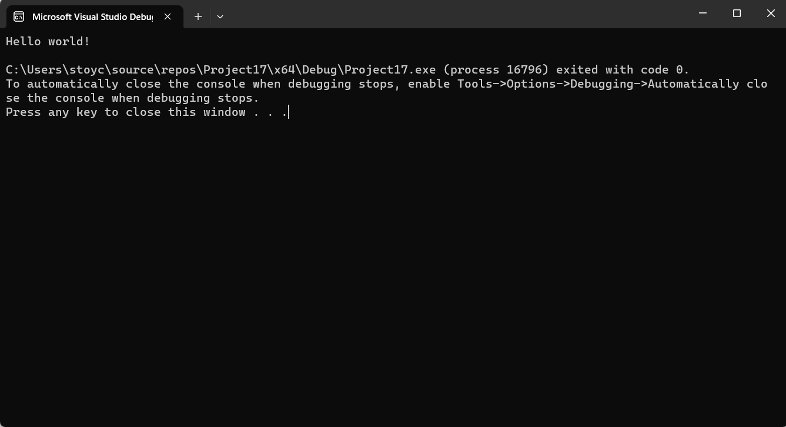

# Първи семинар по увод в програмирането - 03.10.2023

## Кратък увод.
Компютрите могат да извършват множество от задачи. Разбира се, те не извършва задачи на случаен принцип, а някой трябва да им "обясни" какво да направят.
Готовият софтуер е в някакъв смисъл точно това - множество от инструкции, определящи какво да извърши компютъра. Използвайки готов софтуер ние знаем каква е нашата цел и някой друг се е погрижил тази цел да се постигне бързо и ефикасно.

Но как създаваме ние софтуер? Можем ли да пишем наши инструкции към компютъра? Можем, но никой не пише инструкциите директно. Компютърният език е лесен за разбиране от компютъра, но е нечетим за нас хората - точно както човешкия език в чистата си форма е неразбираем за компютъра.

За да създаваме наши програми съществуват междинни езици - езици за програмиране. Те са четими от хора. Същевременно съществуват програми, които превръщат езиците за програмиране в разбираеми за машината инструкции - наши собствени програми.

Integrated development environment (IDE или среда за разработка) е такъв софтуер, който ни помага от език за програмиране да създадем наша програма! Тя идва с нужните инструменти, които да ни помагат при разработката, поддръжката и търсенето на грешки в кода ни.

**Езикът за програмиране, който ще използваме за целите на курса, е С++**

**Средата за разработка която ще използваме за курса е Microsoft Visual Studio**
## Hello world.
Нека напишем първата си програма.
```cpp
#include<iostream>

using namespace std;

int main()
{
   cout << "Hello world!" << endl;
}
```
Когато стартираме програмата виждаме следното:

Изпълнението започва от кода в тялото на main(). Тя се приема като начална точка на програмата.

Използвайки cout изведохме съобщението "Hello world!" на конзолата.
endl (от end line) принтира нов ред на конзолата.


## Променливи и примитивни типове.
В програмите си можем да имаме **променливи**. Променливите се използват за да пазят някаква информация по време на изпълнението на нашата програма. В езика С++ променливите си имат типове. Променливите декларираме следвайки синтаксиса:
```
<тип> <име> = <стойност>;
```

### int
Пази цяло число. Пример:
```cpp
#include<iostream>

using namespace std;

int main()
{
   int number = 145;

   cout << "The value of number is" << number << endl;
}
```
Програмата ще изведе стойността записана в number (в случая 145).
Стойността на типът int може да варира между 

### char
Пази символ. По същия начин както създадохме променлива от тип int можем да създадем такава от тип char.

```cpp
#include<iostream>

using namespace std;

int main()
{
   char ch = 'a';

   cout << "The value of ch is: " << ch << endl;
}
```

### double
Използват се за числа с плаваща запетая. 
```cpp
#include<iostream>

using namespace std;

int main()
{
   double PI = 3.14;

   cout << "The value of variable PI is: " << PI << endl;
}
```

### unsigned int
Типът int може да съхранява и отрицателни стойности. Ако желаем в променливата да имаме записани само положителни стойности използваме unsigned int.

### bool
Типът bool има точно две стойности - истина (1) или лъжа (0). 

Езикът предлага още типове, които ще разглеждаме в следващи семинари.

## Въвеждане на стойности на променливи от конзолата
Можем да въвеждаме стойността на променлива от конзолата по време на изпълнение на програмата:

```cpp
#include<iostream>

using namespace std;

int main() 
{
   int value = 0;

   cin >> value;

   cout << "You entered: " << value << endl;
}
```

## Преобразуване между типове
Можем да присвояваме стойността на един тип на друг. Това присвояване става имплицитно (скрито от нас).
Преобразуването обаче крие рискове от загуба на информация. Ако на променлива от тип bool дадем стойност променлива от тип int в общия случай имаме загуба на информация.

```cpp
int main()
{
   int x = 145;

   // Ако стойността на x е 0 стойността на p e false. Във всички други случаи стойността е true.
   bool p = x; // Получава се загуба на информация, p има стойност true, но първоначалната стойност на x се губи.
}
```

Друг пример за преобразуване със загуба на информация е когато на променлива от тип int дадем стойност на променлива от тип double.

```cpp
int main()
{
   double x = 14.5;

   int y = x; // сега х има стойност 14
}
```
Стойността на y сега е 14 и губим информация от променливата x.

Можем да имаме преобразуване и без загуба на информация. Например ако преобразуваме от bool към int или от int към double информацията не се губи. 

## Оператори
Можем да манипулираме информацията записана в променливите. Това става с помощта на операторите.

### Аритметични оператори
| Оператор | Описание         |
| ---------| ---------------- |
| +        | Събиране         |
| -        | Изваждане        |
| *        | Умножение        |
| /        | Деление          |
| %        | Деление с остатък|

Оператора за делене с остатък не се дефинира за double. 
```cpp
int main()
{
   int x = 10;
   int y = 3;

   int z = x % y; // Стойността на z e остатъка при деление на x с y а именно 1.
   int d = x / y; // Стойността на d e 3. Дробната част от делението се игнорира.
}
```

**Важно** ако в горния пример y беше 0 това би довело до грешка. При целочислени променливи не можем да делим на 0. Типът double го позволява.

### Оператори за сравнение
Можем да сравняваме дали две променливи са равни по стойност с оператора **==**. Те или са равни или не са и този оператор връща булев резултат.
```cpp
int main()
{
   int x = 10;
   int y = 10;

   bool areVariablesEqual = (x == y); // В случая стойността на декларираната променлива е true.
}
```

**Важно:** Променливи от тип double не се сравняват с оператора ==. Има други методи, които ще бъдат разгледани скоро.

Езикът ни предоставя пълния набор от оператори за сравнение.
| Оператор | Описание                                                                     |
| ---------| ---------------------------------------------------------------------------- |
| ==       | Равни ли са двете променливи                                                 |
| !=       | Различни ли са двете променливи                                              |
| <        | Променливата от лявата страна по - голяма ли е от тази от дясната?           |
| >        | Променливата от лявата страна по - голяма ли е от тази от дясната?           |

Също така, за улеснение, имаме операторите >= и <=.

```cpp
int main()
{
   int x = 10;
   int y = 20;

   int first = (x > y); // Каква е стойността на first?
   int second = x * first; // Каква е стойността на second
}
```

## Логически оператори
Операторите && и || представляват конюнкция и дизюнкция. Те приемат две булеви променливи и връщат булев резултат.

Оператора && връща истина когато и двата аргумента са истина:

| Стойност | Стойност|  Резултат |
| ---------| ------  | --------- |
| true     | true    |  true     |
| true     | false   |  false    |
| false    | true    |  false    |
| false    | false   |  false    |


Оператора || връща истина когато и поне един от двата аргумента е истина:

| Стойност | Стойност|  Резултат |
| ---------| ------  | --------- |
| true     | true    |  true     |
| true     | false   |  true     |
| false    | true    |  true     |
| false    | false   |  false    |

Оператора ! представлява негация. Той приема една булева променлива и връща булев резултат. Ако стойността на променливата е true той ще върне false и ако е false ще върне true.

```cpp
int main()
{
   bool first = true;
   bool second = false;
   bool third = true; 

   bool x = first && third; // true
   bool y = first && second; // false

   bool z = (first && third) || (first && second); // Каква е стойността?

   bool p = !first;  // false

   int example = 13;
   bool k = !example;   // Каква е стойността?
   bool t = !!example;   // Каква е стойността?
}
```