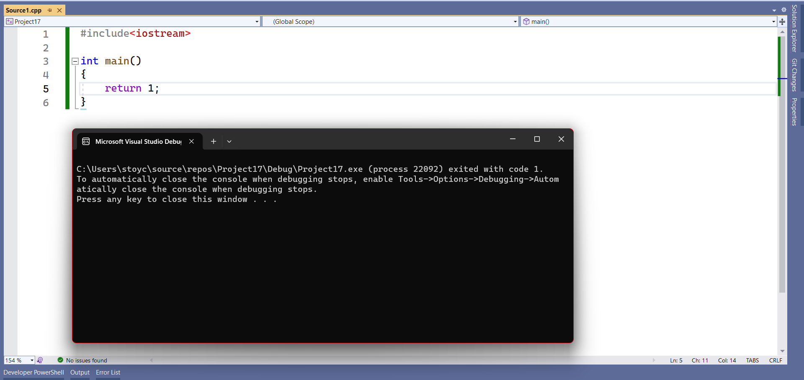

# Четвърти семинар по увод в програмирането - 23.10.2023

## Функции

**Задача 1**
От стандартния вход се въвеждат две числа. Ако първото число е просто се извежда "First number is prime" и изпълнението на програмата приключва. Ако е съставно проверяваме второто число. Ако то е просто се извежда "Second number is prime" в противен случай се извежда "None of the numbers are prime".

Със знанията до момента можем да решим тази задача. Решението би изглеждало по следния начин:
```cpp
#include <iostream>
#include <cmath>

using namespace std;

int main()
{
    unsigned first  = 0;
    unsigned second = 0;

    cin >> first >> second;

    bool isFirstPrime = true;
    if(first > 1)
    {
        double squareOfNumber = sqrt(first);

        for (int i = 2; i <= squareOfNumber; i++)
        {
            if(first % i == 0)
            {
                isFirstPrime = false;
                break;
            }
        }
    }
    else 
    { 
        isFirstPrime = false; 
    }

    if(isFirstPrime)
    {
        cout << "First number is prime";
    }
    else
    {
        bool isSecondPrime = true;
        if(second > 1)
        {
            double squareOfSecondNumber = sqrt(second);

            for (int i = 2; i <= squareOfSecondNumber; i++)
            {
                if(second % i == 0)
                {
                    isSecondPrime = false;
                    break;
                }
            }
        }
        else 
        { 
            isSecondPrime = false; 
        }

        if(isSecondPrime)
        {
            cout << "The second number is prime";
        }
        else
        {
            cout << "None of the numbers are prime";
        }
    }
}
```

Интуитивно трябва да усещаме, че този код не е добър. Да, той работи, при това коректно, но проблемът тук е **преизползването на код**.
Логиката зад кода, проверяващ дали едно число е просто или не, е една и съща. Разликата е в числото, което бива проверено.

С този проблем се справяме използвайки **функции**.

Синтаксис:
```
    <тип на връщане> <име на функцията>(<0 или повече параметри, отделени със запетайки>)
    {
        <Тяло на функцията>
    }
```

За функцията може да си мислим като код, който може да бъде извикван чрез зададено от нас име, който може да връща резултат и на който можем да подаваме нула или повече параметри (променливи).
Това първоначално може да звучи объркващо, но нека видим пример:

```cpp
#include <iostream>

using namespace std;

// Име на функцията: sum
// Тип на връщане: int
// Параметри, които приемаме: firsrNumber и secondNumber от тип int
// Идея: Функцията приема като параметри две числа и връща техния сбор.
int sum(int firstNumber, int secondNumber)
{
    return firstNumber + secondNumber;
}

int main()
{
    int number = sum(3, 4); // Сега, стойността на number е 7.
}
```
Можем да имаме функции, които не връщат нищо. На мястото на типа на връщане пишем ключовата дума `void`.

```cpp
#include <iostream>

using namespace std;

void printNumberToConsole(int number)
{
    cout << "My number is " << number << endl;
}

int main()
{
    printNumberToConsole(1);    // Извежда на конзолата My number is 1
    printNumberToConsole(4);    // Аналогично
    printNumberToConsole(5);    // Аналогично
}
```
Можем да имаме и функции, които не приемат никакви аргументи.

Как бихме написали **Задача 1** използвайки функции?

```cpp
#include<iostream>

using namespace std;

bool isPrime(unsigned number)
{
    if (number < 2)
    {
        return false;
    }
    
    double squareOfNumber = sqrt(number);

    for (int i = 2; i <= squareOfNumber; i++)
    {
        if(number % i == 0)
        {
            return false;
        }
    }
    return true;
}

int main()
{
    unsigned first  = 0;
    unsigned second = 0;

    if(isPrime(first))
    {
        cout << "First number is prime";
    }
    else if(isPrime(second))
    {
        cout << "Second number is prime";
    }
    else
    {
        cout << "None of the numbers are prime";
    }
}
```
Какви са предимствата?
1. Кодът става в пъти по - четим.
2. Кодът става по - кратък.
3. Кодът става в пъти по - лесен за поддръжка.

## Функции, които вече сме виждали.
Всъщност вече сме виждали функции, просто не сме говорили за тях.

Ако се загледаме много внимателно в програмите, които пишем, ще забележим, че `int main() {}` всъщност синтактично отговаря на дефиницията на функция. Това е защото е функция, но е малко по специална функция.

Тя е единствена за нашата програма. Можем да мислим, че цялото изпълнение на програмата започва от нея.

А какво е `sqrt()`? Това също е функция. Тя приема число и връща корен квадратен от числото. Тази функция, както и още други, са написани в библиотеки, идващи с езика C++, за наше удобство.

## За ключовата дума return
Какво представлява ключовата дума `return`, която видяхме в решението на `Задача 1`? След `return` се дава стойността, която да се върне от функцията. Ключовата дума `return` **прекратява веднага изпълнението на функцията**. След като сме извикали веднъж `return` **функцията веднага връща подадената стойност и не се изпълнява нито ред повече от нея.**

## За обща култура - защо main връща int?
В многозадачните операционни системи нашата програма се изпълнява сред много други. Може би някоя от другите програми биха се интересували от това дали нашата програма е завършила успешно или не. main може да връща стойност и когато не ѝ окажем стойност, която да върне, тя по подразбиране връща 0.

Прието е, че когато main върне 0 програмата е протекла успешно. Когато върне 1 е възникнала някаква грешка. Можем да върнем и произволно число в зависимост от ситуацията.

Можем да видим, че конзолата ни известява как е завършила нашата програма.

## Какво е Scope
Нека разгледаме следния пример:
```cpp
#include<iostream>

using namespace std;
int main()
{
    int x = 0;

    if(true)
    {
        int x = 1;

        cout << x << endl;
    }

    cout << x << endl;
}
```
този пример ще се компилира и ще изведе очакваното - 1 и 0. Ако обаче имаме следното:
```cpp
int main()
{
    int x = 0;
    int x = 1;
}
```
това би довело до синтактична грешка казваща, че х вече е дефинирано. Защо в единия случай ни позволява да дефинираме променливи с едни и същи имена а в другия не?

Всяка променлива, която имаме в кода, е видима **само и единствено в нейния scope (скоуп)**. Scope създаваме по следния начин:
```cpp
int main()
{   // Къдравите скоби започват scope-a на функцията main. Функциите си имат scope.
    int x = 10;     // Името на х е свързано със scope-a на main
    int y = 20;     // Името на у е свързано със scope-a на main

    {   // Започваме нов scope.
        int x = 20; // този х принадлежи на текущия scope.
        x += 10;
        y += 10;    // Този у принадлежи на scope-a на main, понеже в текущия scope не сме създали променлива y.
    }   // Край на новия scope
    // Сега, каква е стойността на х и на у?
}
```
Циклите които видяхме в *трети семинар* си имат scope. Функциите, които разглеждаме също имат scope. Има нещо наречено глобален scope. Там също можем да дефинираме променливи.
```cpp
#include<iostream>

int x = 10; // х живее в глобалния скоуп и е видим в целия cpp файл.

int main()
{
    x += 10;    // Валидно, вече х е 20
}
```
Променливите, декларирани в глобалния scope, се наричат **глобални променливи.** Те се различават от локалните (дефинирани в неглобален scope) и често използването им води до проблеми свързани с четимостта и поддръжката на кода. Докато използването им (в някои случаи) прави нещата **моментно** по - лесни и може да забърза изпълнението на програмата, те често са считани за лоша практика и в курса **няма да използваме такива променливи**.

Няма и да имаме нужда.

## Параметри по копие
В началото на курса казахме, че променливите всъщност се пазят в паметта. Всяка променлива си има адрес, в която е записана нейната стойност. Нека разгледаме следния пример:
```cpp
#include<iostream>

using namespace std;

void increment(int argument)
{
    argument++;
}

int main()
{
    int x = 10;
    increment(x);
    cout << x;
}
```
Какво ще изведе този код? Въпросът тук е дали х ще се увеличи с 1 или няма. Отговорът е, че няма да се увеличи с 1. Но защо?
Когато подаваме променливи като аргументи на функции срещаме два основни случая:
1. Работим със **стойността на променливата**. Не ни интересува променливата а **това какво е записано в нея**. В този случай на променливата **се прави копие** понеже се интересуваме **единствено от стойността ѝ**. Това е и случая в разгледания пример. На променливата х, която живее в scope-a на main се прави копие, което живее в scope-a на increment. Това копие живее **до края на scope-a на increment.** След като приключи изпълнението на функцията increment стойността на х е непокътната, понеже сме подали копие.
2. Втория случай е когато трябва да работим **със самата променлива.** Интересуваме се от това **да работим с подадената променлива а не с нейно копие.** За този случай ще говорим скоро и подробно, за момента запомнете концепцията. 
## Задача първа
Напишете функция, която приема неотрицателно число и връща числото обърнато. Приемаме, че числото и обърнатото число се събират в типа int.

## Задача втора
Напишете функция, която приема число и връща броя на цифрите му.

## Задача трета
Напишете функция, която приема неотрицателно число и проверява дали е палиндром.

## Задача четвърта
Да се напише функция, която като параметри приема две числа n и m (нека m < n) и връща сумата в интервала [m, n].

## Задача пета
Напишете функция, която извежда на стандартния екран разбиването на положително число на прости делители.