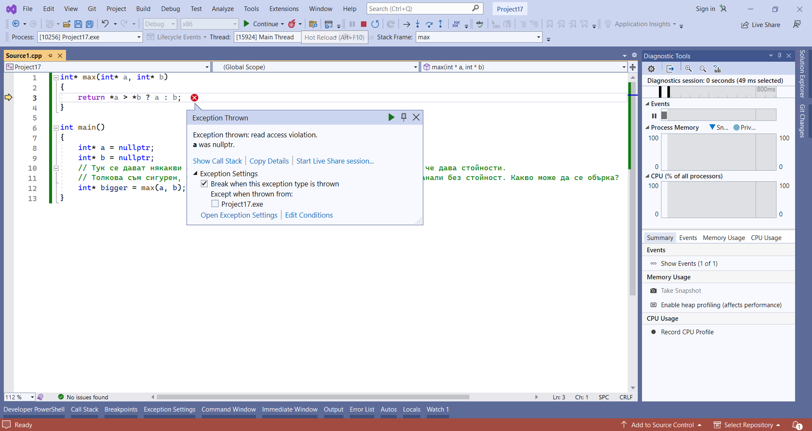

# Десети семинар по увод в програмирането - 04.12.2023

## Задача първа - побитови операции.
Да се напише функция ```int getUniqueElement(const int arr[], unsigned size);``` която приема масив, в който всеки елемент се среща точно два пъти освен един. Функцията връща този елемент.

## Задача втора - побитови операции.
Да се реализира функция ```void printAllSubsets(int arr[], size_t size)``` която принтира всички подмножества на множество представено чрез масив.

Пример:
При

arr = {1, 2}

size = 2

имаме изход

{ }
{ 1 }
{ 2 }
{ 1 2 }

## Указатели.
Когато говорихме за променливи, споменахме, че всяка променлива е записана в паметта. За да достъпим стойността ѝ, четем от даден адрес. За да видим адреса на променлива можем, да използваме оператора `&`.

```cpp
#include <iostream>

int main()
{
    int variable = 14;
    std::cout << "The address of variable is: " << &variable;
}
```

Това би извело
```
The address of variable is: 0xed1cbffa5c
```

Адресът, за наше удобство, се представя в шестнаддесетична бройна система. В езикът С++ има променливи, които пазят в себе си адреси.

```
Указател - Променлива, която пази адрес.
```

Синтаксисът е следния:
```cpp
int* ptr; // Валидно, създава указател, който сочи към адреса на променлива от тип int
int *ptr; // Това също е валиден синтаксис.
```

## Особености на указателите.
Има няколко особености на указателите, които ги правят гъвкави.
1. Указателят може да сочи към "нищото" (за разлика от референцията). Синтаксис:
```cpp
int* ptr = nullptr;
```
2. Указателят може да се пренасочва (за разлика от референцията).

```cpp
int variable = 0;
int secondVariable = 1;
int* ptr = nullptr;
ptr = &variable; // Указателят вече сочи към variable.
ptr = &secondVariable; // Указателят вече сочи към secondVariable.
```
3. Можем да четем и променяме паметта, към която указателите сочат (иначе защо да ги имаме?).
```cpp
int variable = 0;
int* ptr = &variable;
*ptr = 10; // Чрез оператора * достъпваме стойността записана в адреса на указателя.
cout << variable << " " << *ptr; // Това сега ще изведе 10 и 10.
```

Повтаряме:
```
Чрез оператора * достъпваме стойността, записана в адреса на указателя.
ptr  - адрес.
*ptr - стойността, записана в този адрес.
```

## Какво може да се обърка?
Програмата, която пишем, си има памет. В тази памет тя държи променливите (и още други неща, нужни за изпълнението ѝ). Какво става обаче, когато се опитаме да четем в памет, която не принадлежи на процеса?

Неправилната работа с указателите води до грешки. Най-често срещаната е следната:
```cpp
int* max(int* a, int* b)
{
    return *a > *b ? a : b;
}

int main()
{
    int* a = nullptr;
    int* b = nullptr;
    // Тук се дават някакви стойности на а и b. За този код съм на 100% сигурен, че дава стойности.
    // Толкова съм сигурен, че дори няма да проверя дали случайно а или b са останали без стойност. Какво може да се обърка?
    int* bigger = max(a, b);
}
```


Какво се случи тук и защо гръмна?
Да се опиташ да прочетеш стойност от `nullptr` се счита за грешка. В коментарите пише, че сме сигурни, че не са, но грешки винаги стават.

## Връзката между указателите и масивите. Указателна аритметика.
```cpp
#include<iostream>

int main()
{
    int arr[3];
    for(int i = 0; i < 3; i++)
    {
        std::cout << &arr[i] << " ";
    }
}
```

Това извежда:
```
0x4c56dffdd0 0x4c56dffdd4 0x4c56dffdd8
```
Заглеждайки се в адресите (представени като числа в шестнаддесетична бройна система), те са последователни. Не само това, но и разликата между тях е 4. Това не трябва да ни притеснява, дори трябва да е очаквано. Паметта при масивите е **последователна**.

За наше удобство arr може да се преобразува към указател.
```cpp
int* arrPtr = arr;
```

Разбира се, **масивът не е указател** (не можем да пренасочим масив е най-лесната аргументация). Но все пак масивът може да се преобразува към указател и това е с причина.
Указателната аритметика ни позволява да се **движим по последователна памет, имайки указател към елемент.**

```cpp
#include <iostream>

int main()
{
    int arr[4] = {1, 2, 3, 4};
    int* arrPtr = arr;

    std::cout << *arrPtr;           // Извежда първия елемент от масива - 1
    int* ptrSecond = arrPtr + 1;    // Указател към втория елемент от масива

    std::cout << *ptrSecond;        // Извежда втория елемент от масива - 2.

    std::cout << *(arrPtr + 3);     // Извежда четвъртия елемент от масива - 4

    // Тоест ptr + i - премества ptr към i-тия елемент от масива.
}
```
Аналогично, имайки указател към третия елемент можем да се върнем назад изваждайки 1 (примерно).

Всъщност:

```cpp
int arr[10];
int* arrPtr = arr;

arr[2] е същото като *(arr + 2) е същото като *(arrPtr + 2) e същото като arrPtr[2]
```
Когато индексираме, компилатора прави точно ```cpp arr[i] = *(arr + i)```.

## Въведение в символните низове
Работата със текст е неизбежна. Типът, представляващ един символ, е `char`. Поглеждайки реалния свят (примерно този документ) хората рядко използват само един символ. Те използват множество от символи, а за това имаме ли тип?
Разбира се, използваме масив от символи и го наричаме **символен низ** (или още string).

```cpp
char str[] = {'t', 'e', 's', 't', '\0'};
char str2[] = "test"; // еквивалентно на str, просто по - лесно за запис.
char str3[7] = "test";
```
Това е сравнително ясно, защо обаче ни е тази нула в края на низа? Ами нулата ни казва къде свършва текста. Нека си представим, че искаме да прочетем този текст. Четенето става като просто четем, докато не стигнем до **терминиращата нула**. Това са така наречените **null terminated strings**.


## Примери
* unsigned strlen(const char*); - дължина на низ
* char* strcpy(char* destination, char* source); - Копира source в destination
* char* strcat(char* destination, char* source); - Конкатенира два низа.
* int strcmp(const char* str1, const char* str2); - Сравнява два низа лексикографски.
* Търсене на дума в стринг.